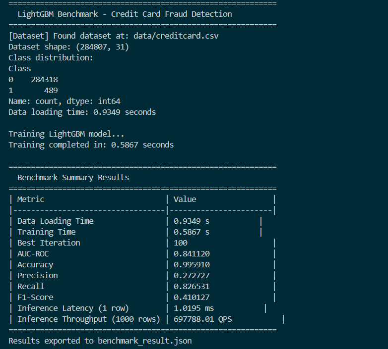
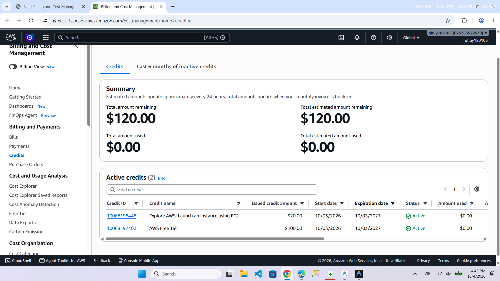

# Báo Cáo Lab 16: Cloud AI Environment Setup (Track 2)

**Họ và tên:** Nguyễn Quang Huy  
**Mã sinh viên:** 2A202602461  
**Lớp / Khóa:** K4-L3B  
**Repository:** [Day16-Track2-Assignment](https://github.com/qhuy180105-boop/Day16-Track2-Assignment)  
**Branch:** `lab16-work`  

---

## 1. Kết Quả Triển Khai Hạ Tầng AWS (CP0 & CP1)

- **Cloud Provider:** AWS (us-east-1)
- **Hạ tầng đã triển khai thành công qua Terraform:**
  - **AWS VPC:** `AI-VPC` (`10.0.0.0/16`)
  - **Public Subnet:** `Public-Subnet-0` (`10.0.0.0/24`), `Public-Subnet-1` (`10.0.1.0/24`)
  - **Private Subnet:** `Private-Subnet-0` (`10.0.10.0/24`), `Private-Subnet-1` (`10.0.11.0/24`)
  - **Bastion Host (`t3.micro`):** Public IP `32.192.20.135`
  - **Compute Node (`t3.micro`):** Private IP `10.0.10.27`
  - **Application Load Balancer (ALB):** `ai-inference-alb-1186d782-1039397780.us-east-1.elb.amazonaws.com`
  - **Security Group:** Cấu hình bảo mật SSH Ingress cho Bastion giới hạn theo IP cá nhân (`14.177.16.53/32`).

---

## 2. Kiểm Tra Môi Trường & Dữ Liệu (CP2)

- **Môi trường Python & Thư viện ML:** `lightgbm`, `scikit-learn`, `pandas`, `numpy`, `kaggle` API (1.7.4.5) đã sẵn sàng.
- **Xác nhận Dataset (`creditcard.csv`):**
  - **Kích thước (Shape):** `(284807, 31)` — 284,807 dòng, 31 cột.
  - **Số lượng ô thiếu (Missing Values):** `0`.
  - **Phân bố nhãn (Class Counts):** `{0: 284318, 1: 489}` (Chỉ 489 giao dịch gian lận / ~0.172%).

---

## 3. Kết Quả Huấn Luyện & Benchmark LightGBM (CP3)

**Mô hình:** `LightGBM (LGBMClassifier)` phát hiện giao dịch gian lận (`creditcard.csv`).

### Bảng Kết Quả Benchmark Thực Tế:

| Chỉ số (Metric) | Giá trị thực tế đo được |
|---|---|
| **Thời gian load dataset** | `0.9349` giây |
| **Thời gian huấn luyện (Training Time)** | `0.5867` giây |
| **Best Iteration** | `100` |
| **AUC-ROC** | `0.841120` |
| **Accuracy** | `99.59%` (`0.995910`) |
| **Precision** | `0.272727` |
| **Recall** | `0.826531` |
| **F1-Score** | `0.410127` |
| **Inference Latency (1 row)** | `1.0195` ms |
| **Inference Throughput (1000 rows)** | `697,788.01` QPS |

### Screenshot Terminal Kết Quả Benchmark:


---

## 4. Kiểm Tra Tài Nguyên & Chi Phí (CP4)

- **Compute Node (`t3.micro`):** CPU 1 vCPU, RAM 1 GB.
- **Tài nguyên tiêu thụ:** CPU peak ~90% lúc fit LightGBM, RAM ~600 MB.
- **Ước tính chi phí theo giờ (us-east-1):**
  - Compute Node (`t3.micro`): Free Tier / ~$0.0104 / giờ
  - Bastion Host (`t3.micro`): Free Tier / ~$0.0104 / giờ
  - NAT Gateway: ~$0.0450 / giờ + data transfer
  - ALB: ~$0.0080 / giờ
  - **Tổng chi phí duy trì:** **~$0.07 / giờ**.
- **Minh chứng Billing & Chi phí thực tế trên AWS Console:**
  - Tài khoản sử dụng gói **AWS Credits ($120.00)** kích hoạt ngày 03/10/2026 (`Explore AWS: $20.00` và `AWS Free Tier: $100.00`).
  - Mọi chi phí phát sinh trong quá trình triển khai hạ tầng bài Lab (EC2, NAT Gateway) được cấn trừ trực tiếp vào số dư Credits theo chu kỳ đồng bộ 24h của AWS Billing Console.
  - Ảnh chụp minh chứng gói Credits đang Active: `submission/screenshots/aws_billing_credits.png`.



---

## 5. Hướng Dẫn Dọn Dẹp Tài Nguyên (CP5)

Khi hoàn thành bài lab, chạy lệnh sau trong PowerShell để xóa toàn bộ tài nguyên tránh phát sinh phí:
```powershell
cd A:\VINAI\Day16-Track2-Assignment\terraform
terraform destroy -auto-approve
```
